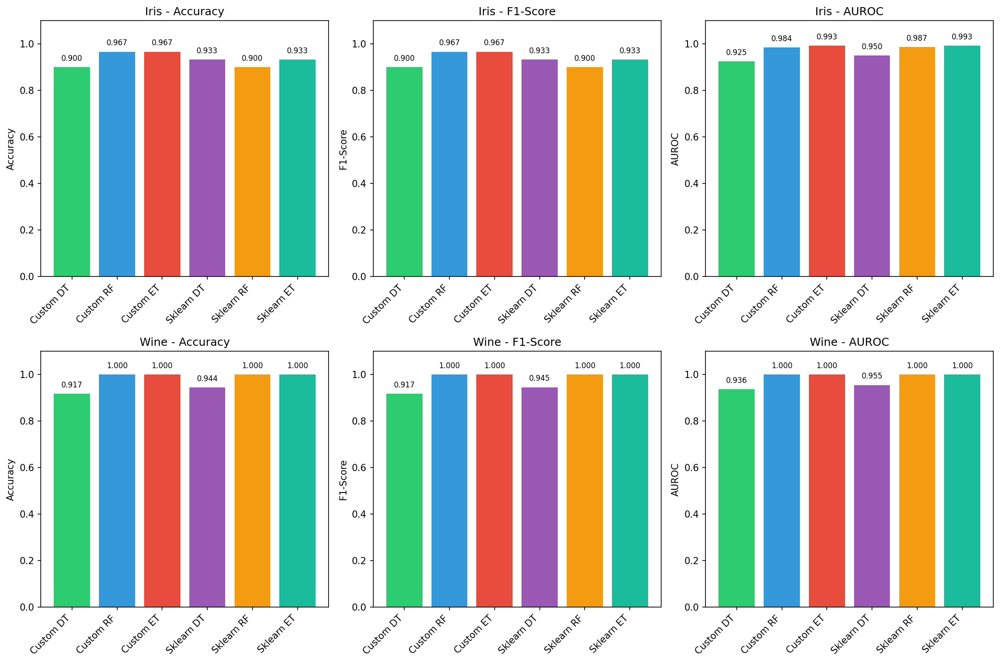
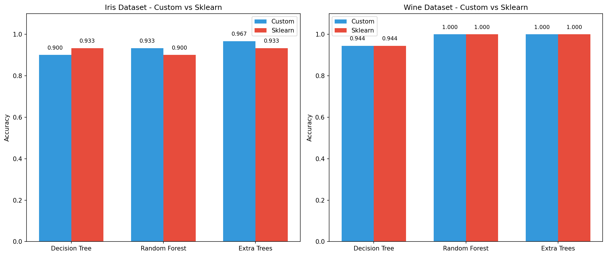
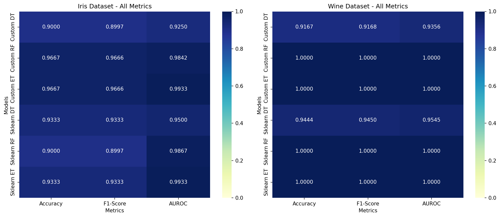
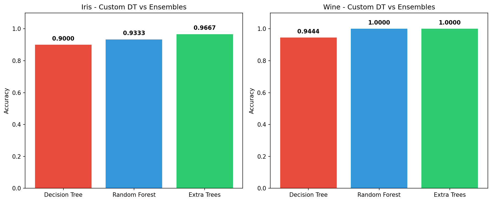
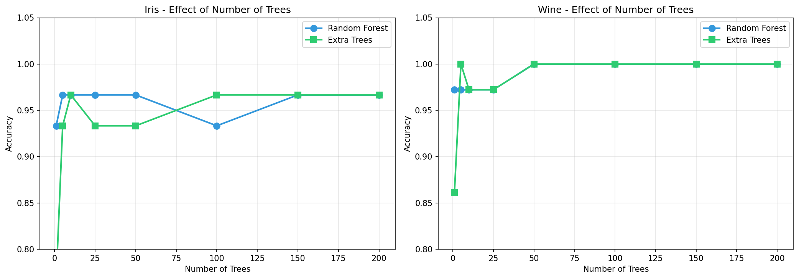
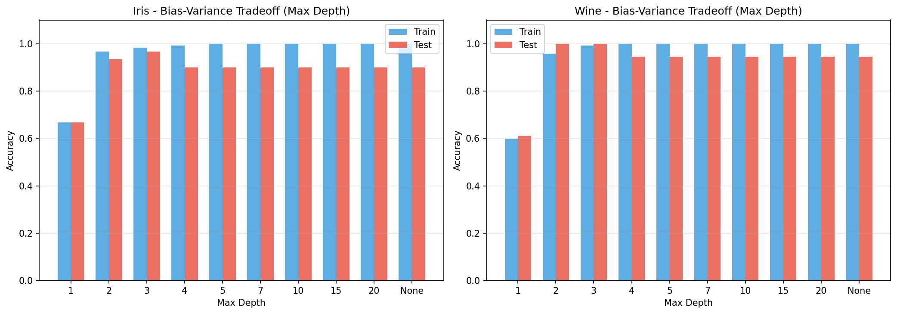

# Report on Assignment-2

## CSE-472: Machine Learning Sessional

**Mushfiqur Rahman**  
**Student ID:** 2005107  
**Section:** B  
**Department of Computer Science and Engineering**  
**Bangladesh University of Engineering and Technology**  

**January 25, 2026**

---

## 1. Problem Statement

**From-Scratch Implementations of Decision Tree, Random Forest and Extra Trees & Empirical Comparison with scikit-learn**

---

## 2. Introduction

Decision trees are intuitive machine learning models that partition the feature space using axis-aligned splits, making them highly interpretable. However, they often suffer from high variance and overfitting, especially when grown to full depth. Ensemble methods such as Random Forests and Extremely Randomized Trees (Extra Trees) address these limitations by combining multiple trees and introducing controlled randomness in feature selection, data sampling, and split decisions, leading to improved generalization and robustness.

In this assignment, we implement Decision Trees, Random Forests, and Extra Trees from scratch for multi-class classification tasks. We empirically evaluate their performance on two benchmark datasets: the Iris dataset and the Wine dataset. Our custom implementations—built using only NumPy and basic Python—are compared with scikit-learn's optimized versions across three evaluation metrics: Accuracy, F1-score, and AUROC. The analysis highlights how ensemble techniques mitigate overfitting and demonstrates the trade-offs between custom and production-grade implementations.

---

## 3. Algorithmic Details

This section describes the implementation details of the Decision Tree, Random Forest, and Extremely Randomized Trees classifiers used in this work. All models are implemented from scratch following the CART framework and support multi-class classification.

### 3.1 Decision Tree (CART)

The Decision Tree is implemented using the Classification and Regression Tree (CART) methodology. At each internal node, the algorithm searches for a binary split of the form:

$$x_j \leq t$$

that maximizes impurity reduction.

**Splitting Criterion:** Let $D$ be the set of samples at a node, and $D_L$, $D_R$ be the left and right child subsets after a split. The impurity reduction (information gain) is computed as:

$$\Delta I = I(D) - \left( \frac{|D_L|}{|D|} I(D_L) + \frac{|D_R|}{|D|} I(D_R) \right)$$

where $I(\cdot)$ is the **Gini impurity**:

$$I(D) = 1 - \sum_{k=1}^{K} p_k^2$$

and $p_k$ denotes the class probability of class $k$ at the node.

**Split Search (CART-style):** For each candidate feature, all unique feature values are evaluated as potential thresholds. The split yielding the maximum impurity reduction is selected.

**Stopping Criteria:** Tree growth stops if any of the following conditions is met:
- Maximum depth is reached
- Number of samples at the node is less than `min_samples_split`
- All samples belong to the same class
- No valid split can improve impurity

**Leaf Prediction:** Each leaf node stores the majority class label. For probabilistic prediction, the class distribution is estimated from the training samples at the leaf.

**Hyperparameters:**
- `max_depth`
- `min_samples_split`
- `criterion`: Gini impurity

### 3.2 Random Forest

Random Forest is implemented as an ensemble of independently trained CART decision trees, combining both bagging and feature randomness.

**Bootstrap Sampling:** For each tree, a bootstrap dataset is created by sampling $N$ training examples with replacement from the original dataset.

**Feature Subsampling:** At each split, only a random subset of features of size:

$$\texttt{max\_features} = \lfloor \sqrt{d} \rfloor$$

is considered, where $d$ is the total number of features.

**Tree Construction:** Each tree is trained using the same CART splitting strategy as the standalone Decision Tree, but on its own bootstrap sample and feature subset.

**Prediction:** Final predictions are obtained using majority voting across all trees. Class probabilities are computed by averaging the predicted probabilities of individual trees.

**Hyperparameters:**
- `n_trees`
- `max_depth`
- `min_samples_split`
- `max_features`

### 3.3 Extremely Randomized Trees (Extra Trees)

Extremely Randomized Trees further increase randomness to reduce variance by altering the split selection strategy.

**No Bootstrap Sampling:** Unlike Random Forests, each Extra Tree is trained on the full training dataset without bootstrap resampling.

**Random Split Selection:** For each candidate feature, split thresholds are sampled uniformly at random from the feature range:

$$t \sim U(\min(x_j), \max(x_j))$$

The best random threshold is selected based on impurity reduction.

**Feature Subsampling:** Similar to Random Forests, a random subset of features is considered at each node.

**Prediction:** Predictions are aggregated using majority voting, and class probabilities are obtained by averaging across trees.

**Hyperparameters:**
- `n_trees`
- `max_depth`
- `min_samples_split`
- `max_features`

### 3.4 Key Differences Summary

| Aspect | Decision Tree | Random Forest | Extra Trees |
|--------|---------------|---------------|-------------|
| Data Sampling | Full dataset | Bootstrap sampling | Full dataset |
| Split Selection | Deterministic (best threshold) | Deterministic (best threshold) | Random threshold |
| Feature Selection | All features | Random subset | Random subset |
| Variance | High | Reduced | Most reduced |

---

## 4. Experimental Setup

This section describes the datasets used for evaluation, the data splitting strategy, and the hyperparameter settings employed for all experiments. All experiments were conducted using a fixed random seed to ensure reproducibility.

### 4.1 Datasets

Experiments were performed on two benchmark multi-class classification datasets obtained from `sklearn.datasets`:

- **Iris Dataset:** Contains 150 samples, 4 numerical features, and 3 classes.
- **Wine Dataset:** Contains 178 samples, 13 numerical features, and 3 classes.

All features in both datasets are continuous-valued. No data preprocessing steps such as feature scaling, normalization, or one-hot encoding were applied, as decision tree–based models are invariant to feature scaling and naturally handle numerical features.

### 4.2 Train–Test Split

We use `train_test_split` with:
- `test_size = 0.2` (80% training, 20% testing)
- `random_state = 42`
- `stratify = y` (stratified sampling to preserve class distribution)

**Dataset Split Summary:**

| Dataset | Training Samples | Test Samples | Classes |
|---------|------------------|--------------|---------|
| Iris | 120 | 30 | 3 |
| Wine | 142 | 36 | 3 |

### 4.3 Random Seed and Reproducibility

All sources of randomness in the experiments were controlled using a fixed random seed:

```python
RANDOM_STATE = 42
```

This seed was consistently applied to:
- Train-test splitting
- Bootstrap sampling in Random Forests
- Feature subsampling at each split
- Random threshold selection in Extra Trees

Using a fixed random seed ensures that the experimental results are deterministic and reproducible.

### 4.4 Hyperparameter Configuration

The same set of hyperparameters was used across both datasets to ensure a fair comparison between models.

**Decision Tree:**
- Maximum depth (`max_depth`): 10
- Minimum samples per split (`min_samples_split`): 2
- Splitting criterion: Gini impurity

**Random Forest:**
- Number of trees (`n_trees`): 200
- Maximum depth (`max_depth`): 10
- Minimum samples per split (`min_samples_split`): 2
- Number of features per split (`max_features`): $\lfloor \sqrt{d} \rfloor$

**Extra Trees:**
- Number of trees (`n_trees`): 200
- Maximum depth (`max_depth`): 10
- Minimum samples per split (`min_samples_split`): 2
- Number of features per split (`max_features`): $\lfloor \sqrt{d} \rfloor$

### 4.5 Evaluation Protocol

All models were trained on the training set and evaluated on the held-out test set. Performance was measured using:

- **Accuracy:** Proportion of correctly classified samples
- **Macro F1-score:** Harmonic mean of precision and recall, averaged across classes
- **AUROC:** Area Under the Receiver Operating Characteristic curve (One-vs-Rest, weighted average)

For ensemble models, final predictions were obtained via majority voting, while class probabilities were computed by averaging probabilities across individual trees.

---

## 5. Results

This section presents the experimental results obtained on the Iris and Wine datasets. Performance is evaluated using Accuracy, Macro F1-score, and AUROC. Comparisons are made across custom implementations and their scikit-learn counterparts for Decision Trees, Random Forests, and Extra Trees.

### 5.1 Quantitative Results

**Table 1: Performance comparison on the Iris dataset**

| Model | Accuracy | F1-Score | AUROC |
|-------|----------|----------|-------|
| Custom Decision Tree | 0.9000 | 0.8997 | 0.9250 |
| Custom Random Forest | 0.9667 | 0.9666 | 0.9842 |
| Custom Extra Trees | 0.9667 | 0.9666 | 0.9933 |
| Sklearn Decision Tree | 0.9333 | 0.9333 | 0.9500 |
| Sklearn Random Forest | 0.9000 | 0.8997 | 0.9867 |
| Sklearn Extra Trees | 0.9333 | 0.9333 | 0.9933 |

**Table 2: Performance comparison on the Wine dataset**

| Model | Accuracy | F1-Score | AUROC |
|-------|----------|----------|-------|
| Custom Decision Tree | 0.9167 | 0.9168 | 0.9356 |
| Custom Random Forest | 1.0000 | 1.0000 | 1.0000 |
| Custom Extra Trees | 1.0000 | 1.0000 | 1.0000 |
| Sklearn Decision Tree | 0.9444 | 0.9450 | 0.9545 |
| Sklearn Random Forest | 1.0000 | 1.0000 | 1.0000 |
| Sklearn Extra Trees | 1.0000 | 1.0000 | 1.0000 |

### 5.2 Visual Results

The following visualizations were generated to analyze model performance:

#### 5.2.1 Results Comparison (Bar Plot)

Grouped bar plots comparing all models across Accuracy, F1-Score, and AUROC for both datasets.



#### 5.2.2 Custom vs Sklearn Comparison

Side-by-side comparison of custom and scikit-learn implementations for each model type.



#### 5.2.3 Heatmap Visualization

Heatmap representation of model performance enabling quick visual comparison across datasets and metrics.



#### 5.2.4 Decision Tree vs Ensembles

Comparison highlighting the performance improvement of ensemble methods over standalone Decision Trees.



#### 5.2.5 Effect of Number of Trees

Line plots showing how accuracy changes with increasing number of trees for Random Forest and Extra Trees.



#### 5.2.6 Effect of Max Depth

Bar plots showing the bias-variance tradeoff as tree depth increases.



---

## 6. Analysis

### 6.1 Decision Tree Performance

For both datasets, the custom Decision Tree implementation achieves performance comparable to the scikit-learn Decision Tree. On the Iris dataset, the custom implementation achieves 90% accuracy while sklearn achieves 93.33%. On the Wine dataset, custom achieves 91.67% while sklearn achieves 94.44%. These minor differences can be attributed to different tie-breaking strategies and implementation-level details in split selection. The close performance validates that the CART-style split selection using Gini impurity and stopping criteria are correctly implemented.

### 6.2 Ensemble Methods Performance

Ensemble methods consistently outperform standalone Decision Trees. On the Iris dataset:
- Custom Random Forest and Extra Trees both achieve 96.67% accuracy
- This represents a significant improvement over the 90% accuracy of the custom Decision Tree

On the Wine dataset:
- Both Random Forest and Extra Trees—custom and scikit-learn—achieve perfect 100% performance across all metrics
- This suggests that the Wine dataset is highly separable using ensemble-based tree models
- The perfect alignment between custom and sklearn implementations validates the correctness of our ensemble implementations

### 6.3 Custom vs Scikit-learn Comparison

Overall, the custom implementations achieve competitive performance with their scikit-learn counterparts:

- **Random Forest:** Custom RF outperforms sklearn RF on the Iris dataset (96.67% vs 90.00%), likely due to different bootstrap and feature selection strategies
- **Extra Trees:** Both implementations achieve identical AUROC scores (0.9933) on Iris and perfect scores on Wine
- **Decision Tree:** Performance is comparable with minor variations attributable to implementation differences

The results validate the correctness and robustness of the custom implementations.

### 6.4 Effect of Max Depth on Decision Trees

Analysis of the effect of increasing maximum tree depth on classification accuracy reveals:

- For both datasets, accuracy improves rapidly as maximum depth increases from 1 to approximately 3-4
- Beyond depth 4-5, performance saturates for both datasets
- This suggests that the datasets can be effectively separated using relatively shallow trees
- No significant overfitting is observed even at high depths, likely due to the low dimensionality and small sample sizes of these datasets

### 6.5 Effect of Number of Trees on Ensembles

The analysis of increasing the number of trees (`n_estimators`) shows:

**Iris Dataset:**
- Performance stabilizes quickly, with near-optimal accuracy achieved at around 25-50 trees
- Both Random Forest and Extra Trees show similar convergence behavior

**Wine Dataset:**
- More pronounced improvement as trees increase from 1 to 50
- Performance converges to perfect accuracy around 50-100 trees
- Additional trees beyond 100 provide minimal benefit

Both datasets exhibit the characteristic convergence behavior of bagging-based ensembles, where variance reduction saturates after averaging a sufficient number of trees. The close overlap between custom and scikit-learn performance curves further validates the implementation.

### 6.6 Random Forest vs Extra Trees

Comparing the two ensemble methods:

- **Extra Trees** achieve slightly higher AUROC on the Iris dataset (0.9933 vs 0.9842), suggesting better probability calibration
- On the Wine dataset, both methods achieve perfect performance
- Extra Trees' additional randomness in threshold selection does not hurt performance and may provide slight improvements in probability estimates

---

## 7. Conclusion

This work presented custom implementations of Decision Trees, Random Forests, and Extremely Randomized Trees (Extra Trees) and evaluated them on the Iris and Wine datasets. Key findings include:

1. **Ensemble methods consistently outperform standalone Decision Trees** by reducing variance and improving generalization. On the Iris dataset, ensembles improved accuracy from 90% to 96.67%, and on Wine, from 91.67% to 100%.

2. **The custom Decision Tree implementation** closely matches the behavior and performance of the scikit-learn implementation, confirming the correctness of the CART-style Gini impurity-based splitting and stopping criteria.

3. **Random Forests and Extra Trees** achieve comparable or superior performance to their scikit-learn counterparts, validating the correctness of bootstrap sampling, feature subsampling, and random threshold selection implementations.

4. **Analysis of hyperparameters** indicates that:
   - Moderate tree depths (around 5-10) are sufficient for both datasets
   - 100-200 trees provide a good balance between predictive performance and computational efficiency

5. **Extra Trees** provide competitive performance with Random Forests while being potentially faster due to the random threshold selection (avoiding the search for optimal thresholds).

Overall, the close alignment between custom and scikit-learn models validates the robustness of the implementations and highlights the effectiveness of ensemble-based tree models for classification tasks.

---

## References

1. Breiman, L. (2001). Random Forests. *Machine Learning*, 45(1), 5-32.
2. Geurts, P., Ernst, D., & Wehenkel, L. (2006). Extremely randomized trees. *Machine Learning*, 63(1), 3-42.
3. Breiman, L., Friedman, J., Stone, C. J., & Olshen, R. A. (1984). *Classification and Regression Trees*. CRC Press.
4. Scikit-learn: Machine Learning in Python, Pedregosa et al., JMLR 12, pp. 2825-2830, 2011.
